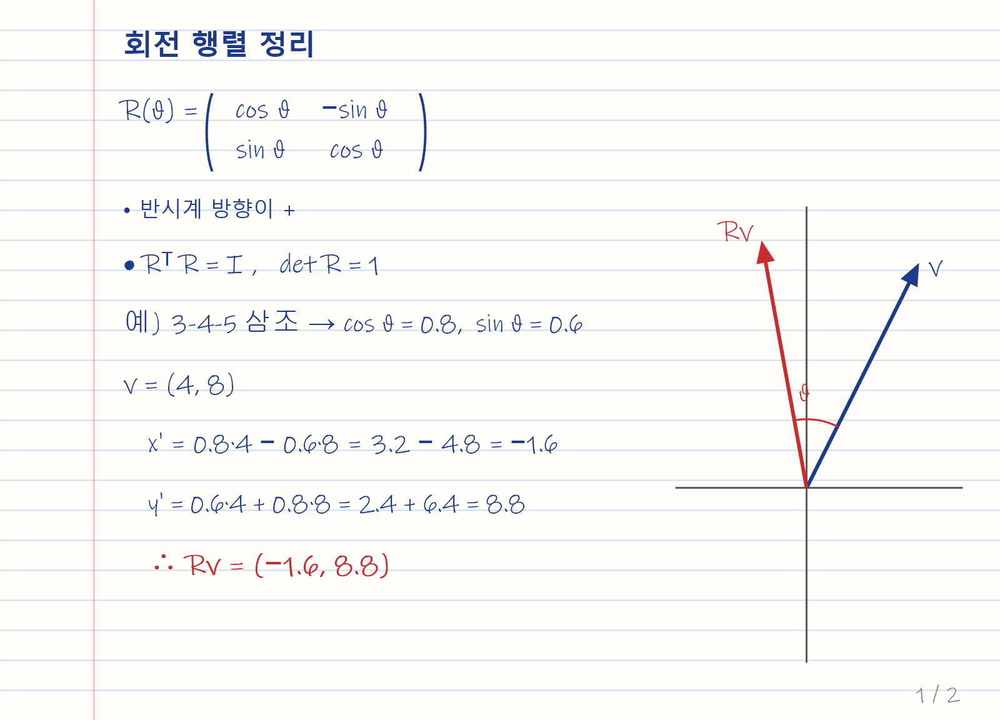
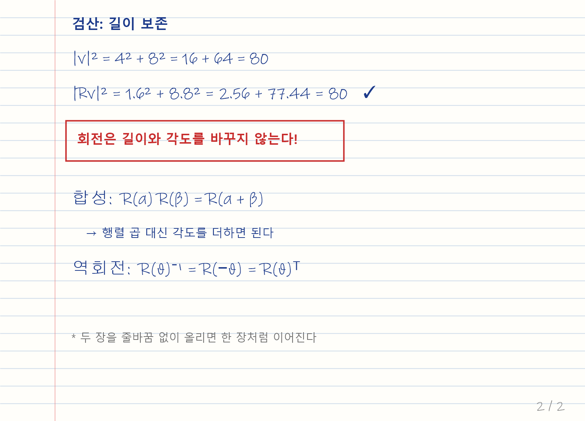

이 글은 블로그가 각 종류의 파일을 어떻게 보여 주는지 확인하는 예시입니다. 필요 없어지면 글쓰기 도구의 **글 관리**에서 지우면 됩니다.

## 1. Markdown 파일과 수식

아래는 `회전행렬_정리.md` 파일을 통째로 넣은 것입니다. `$...$`, `$$` 블록, `aligned`의 `\\` 줄바꿈, 표 안의 `$|x|$`가 모두 그대로 표시됩니다.

## 2. 이어 붙인 필기 이미지

두 이미지를 줄바꿈 없이 바로 아랫줄에 적었기 때문에 한 장처럼 틈 없이 붙어 보입니다. 이미지를 누르면 크게 볼 수 있습니다.

## 3. PDF 전체 쪽

PDF는 모든 쪽이 순서대로 펼쳐집니다.

## 4. HTML 페이지

HTML 파일은 페이지 높이 전체가 보이고, 안의 버튼과 슬라이더도 그대로 동작합니다.

